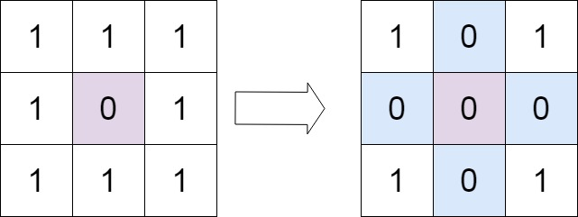
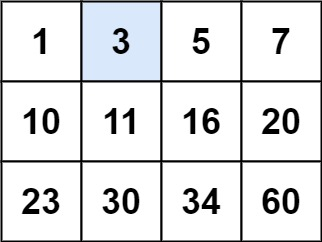
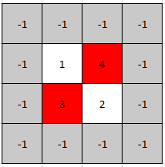
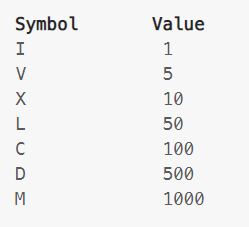

# Programs in first.js (with file navigation)

1. Get Unique Characters from a string — [getUniquechar.js](getUniquechar.js)
2. Check if a String is a Palindrome — [palindrome.js](palindrome.js)
3. Remove Duplicates from a String — [removeDuplicates.js](removeDuplicates.js)
4. Find the First Non-Repeating Character — [firstNonRepeating.js](firstNonRepeating.js)
5. Count the Occurrences of Each Character — [occurenceValue.js](occurenceValue.js)
6. Reverse Words in a Sentence — [reverseWordSentence.js](reverseWordSentence.js)
7. Check if Two Strings are Anagrams — [checkAnagrams.js](checkAnagrams.js)
8. Find the Longest Substring Without Repeating Characters — [longestSubStringWithoutRepeat.js](longestSubStringWithoutRepeat.js)
9. Convert a String to an Integer (atoi Implementation) — [program9.js](program9.js)
10. Compress a String (Run-Length Encoding) — [program10.js](program10.js)
11. Find the Most Frequent Character — [program11.js](program11.js)
12. Find All Substrings of a Given String — [program12.js](program12.js)
13. Check if a String is a Rotation of Another String — [program13.js](program13.js)
14. Remove All White Spaces from a String — [program14.js](program14.js)
15. Check if a String is a Valid Shuffle of Two Strings — [program15.js](program15.js)
16. Convert a String to Title Case — [titleCaseString.js](titleCaseString.js)
17. Find the Longest Common Prefix — [program17.js](program17.js)
18. Convert a String to a Character Array — [program18.js](program18.js)
19. Replace Spaces with %20 (URL Encoding) — [program19.js](program19.js)
20. Convert a Sentence into an Acronym — [acronymSentence.js](acronymSentence.js)
21. Check if a String Contains Only Digits  — [program21.js](program21.js)
22. Find the Number of Words in a String   — [program22.js](program22.js)
23. Remove a Given Character from a String — [program23.js](program23.js)
24. Find the Shortest Word in a String — [shortestWordString.js](shortestWordString.js)
25. Find the Longest Palindromic Substring  — [program25.js](program25.js)
26. closure function — [closurefn.js](closurefn.js)
27. factorial program — [factorial.js](factorial.js)
28. isPrime Number program — [isPrime.js](isPrime.js)
29. Prime Number series program — [primeSeries.js](primeSeries.js)
30. Occurence Number program — [occurenceValue.js](occurenceValue.js)
31. factorial recursive program — [recursivefactorial.js](recursivefactorial.js)
32. union array program — [unionArray.js](unionArray.js)
33. intersection program — [intersectionArray.js](intersectionArray.js)
34. fibonacci series — [fibonacciSeries.js](fibonacciSeries.js)
35. currying function — [curryingfn.js](curryingfn.js)
36. transpose matrix — [transposeMatrix.js](transposeMatrix.js)
37. input-change-output-question1 — [inputchangeoutput1.js](inputchangeoutput1.js)
38. Longest word in string — [program38.js](program38.js)
39. i/p let str = "this tage hash tag"; - o/p #ThisTageHashTag — [program39.js](program39.js)
40. let str = 'mississippi' find count of i — [program40.js](program40.js)
41. find the char is upper case or not — [program41.js](program41.js)
42. string start with arg: checks("hello worlds",'hello') / a.startsWith(b)  — [program42.js](program42.js)
43. reverse string without using pre defined method — [reverseString.js](reverseString.js)
44. find mean of given array = [1,2,3,4,5] : o/p 3  — [program44.js](program44.js)
45. find mean median from given array = [1,2,3,4,5,6] : means add/length , median middle number  — [program45.js](program45.js)
46. repeate('abc',5) : o/p 'abcabcabcabcabc' — [program46.js](program46.js)
47. create random color — [createRandomColor.js](createRandomColor.js)
48. let arr = [43,12,43,55,78,99,09,88,55,78,43,21,56,21]; :  remove duplicate
49. range of number rec(start = 1 , end = 6) — [printrange.js](printrange.js)
50. sliding window k = 3 ;  [1,2,4,5,2,5,6,7] — [slidingWindow.js](slidingWindow.js)
51. print 1 to 10 every 1 sec. — [print1to10.js](print1to10.js)
52. Valid Parentheses in an Expression — [validparentheses.js](validparentheses.js)
53. How to compute (a + b) mod m in programming — [program53.js](program53.js)
54. Binary search array with target value — [program54.js](program54.js)
55. Given n pairs of parentheses, write a function to generate all combinations of well-formed parentheses. — [program56.js](program56.js)
56. Generate parentheses in an Expression. — [program56.js](program56.js)
57. You’ve given an array which contains some 0, your to write a function which moves all 0s to the right of the array.
58. You’ve an array in which each adjacent number is either +1 or -1, write a function to find the given number. Focus on efficiency.
59. Example: [4,5,6,7,6,5,4] // Find index of 7 (from starting)
60. Write a function to shuffle an array.
61. Write a function which gives us a fibonacci sequence of a given number. — [program61.js](program61.js)
62. You have an array, which contains some bad numbers, bad  numbers are denoted with -1, write a function to remove all bad numbers from the array.
63. Write a function to flatten a given array.  — [program63.js](program63.js)
64. Write a function which merges to given array.
65. Given an array containing n distinct numbers taken from 0, 1, 2, ..., n, find the one that is missing.
66. Write a function which deep-clones a given object.
67. Write a function which deep-compares passed value.
68. Write a function which implements ==15. Write a function which works like a new Keyword.
69. Write a function which makes a chain of promise
70. Write a function which validates if a given set of parentheses are valid or not.— [validparentheses.js](validparentheses.js)
71. Implement a basic string compression algorithm. For example, the string "aaabbbcc" should be compressed to "a3b3c2". — [program71.js](program71.js)
72. Map polyfill. — [program72.js](program72.js)
73. Filter polyfill — [program73.js](program73.js)
74. Reduce polyfill — [program74.js](program74.js)
75. Some and Every function polyfill — [program75.js](program75.js) — [program75Every.js](program75Every.js)
76. Push and Pop polyfill — [program76.js](program76.js)
77. Slice and Splice polyfill — [program77.js](program77.js)
78. Call Bind and Apply polyfill — [program78.js](program78.js)
79. Promise.all polyfill — [program79.js](program79.js)
80. Debounce polyfill  — [program80.js](program80.js)
81. Throttle polyfill  — [program81.js](program81.js)
82. JSON.stringify polyfill  — [program82.js](program82.js)
83. forEach polyfill. — [program83.js](program83.js)
84. Implementing Bubble Sort.  — [program84.js](program84.js)
85. Implementing Selection Sort — [program85.js](program85.js)
86. Check if a Number is Armstrong
87. Binary Search
Given an array of integers nums which is sorted in ascending order, and an
integer target, write a function to search target in nums. If target exists, then
return its index. Otherwise, return -1.
You must write an algorithm with O(log n) runtime complexity.

Example 1:

- Input: nums = [-1,0,3,5,9,12], target = 9
- Output: 4

88. Find the Duplicate Number
Given an array of integers nums containing n + 1 integers where each integer
is in the range [1, n] inclusive.
There is only one repeated number in nums, return this repeated number.
You must solve the problem without modifying the array nums and uses only
constant extra space.

Example 1:

- Input: nums = [1,3,4,2,2]
- Output: 2

89. Search Insert Position
Given a sorted array of distinct integers and a target value, return the index if
the target is found. If not, return the index where it would be if it were inserted
in order.
You must write an algorithm with O(log n) runtime complexity.

Example 1:

- Input: nums = [1,3,4,2,2]
- Output: 2

90. Sort Colors
Given an array nums with n objects colored red, white, or blue, sort them in-
place so that objects of the same color are adjacent, with the colors in the
order red, white, and blue.
We will use the integers 0, 1, and 2 to represent the color red, white, and blue,
respectively.
You must solve this problem without using the library's sort function.

Example 1:

- Input: nums = [2,0,2,1,1,0]
- Output: [0,0,1,1,2,2]

91. Find First and Last Position of Element in Sorted Array
Given an array of integers nums sorted in non-decreasing order, find the
starting and ending position of a given target value.
If target is not found in the array, return [-1, -1].
You must write an algorithm with O(log n) runtime complexity.

Example 1:

- Input: nums = [5,7,7,8,8,10], target = 8
- Output: [3,4]

92. Length of Last Word
Given a string s consisting of words and spaces, return the length of the last
word in the string.
A word is a maximal substring consisting of non-space characters only.

Example 1:

- Input: s = "Hello World"
- Output: 5

93. Set Matrix Zeroes
Given an m x n integer matrix matrix, if an element is 0, set its entire row and
column to 0's.
You must do it in place.

Example 1:

- 
- Input: matrix = [[1,1,1],[1,0,1],[1,1,1]]
- Output: [[1,0,1],[0,0,0],[1,0,1]]

94. Pascal's Triangle
Given an integer numRows, return the first numRows of Pascal's triangle.
In Pascal's triangle, each number is the sum of the two numbers directly
above it as shown:

Example 1:

- Input: numRows = 5
- Output: [[1],[1,1],[1,2,1],[1,3,3,1],[1,4,6,4,1]]

95. Single Element in a Sorted Array
You are given a sorted array consisting of only integers where every element
appears exactly twice, except for one element which appears exactly once.
Return the single element that appears only once.
Your solution must run in O(log n) time and O(1) space.

Example 1:

- Input: nums = [1,1,2,3,3,4,4,8,8]
- Output: 2

96. Search a 2D Matrix
You are given an m x n integer matrix matrix with the following two properties:

- Each row is sorted in non-decreasing order.
- The first integer of each row is greater than the last integer of the
previous row.
Given an integer target, return true if target is in matrix or false otherwise.
You must write a solution in O(log(m * n)) time complexity.

Example 1:

- 
- Input: matrix = [[1,3,5,7],[10,11,16,20],[23,30,34,60]], target = 3
- Output: true

97. Pow(x, n)
Implement pow(x, n), which calculates x raised to the power n (i.e., xn).

Example 1:

- Input: x = 2.00000, n = 10
- Output: 1024.00000

98. Find a Peak Element II
A peak element in a 2D grid is an element that is strictly greater than all of
its adjacent neighbors to the left, right, top, and bottom.
Given a 0-indexed m x n matrix mat where no two adjacent cells are equal,
find any peak element mat[i][j] and return the length 2 array [i,j].
You may assume that the entire matrix is surrounded by an outer perimeter
with the value -1 in each cell.
You must write an algorithm that runs in O(m log(n)) or O(n log(m)) time.

Example 1:

- Input: mat = [[1,4],[3,2]]
- Output: [0,1]

99. Max Value of Equation
You are given an array points containing the coordinates of points on a 2D
plane, sorted by the x-values, where points[i] = [xi, yi] such that xi < xj for all 1
<= i < j <= points.length. You are also given an integer k.
Return the maximum value of the equation yi + yj + |xi - xj| where |xi - xj| <= k
and 1 <= i < j <= points.length.
It is guaranteed that there exists at least one pair of points that satisfy the
constraint |xi - xj| <= k.

Example 1:

- Input: x = [[1,3],[2,0],[5,10],[6,-10]], k = 1, n = 1
- Output: 4

100. Jump Game
You are given an integer array nums. You are initially positioned at the
array's first index, and each element in the array represents your maximum
jump length at that position.
Return true if you can reach the last index, or false otherwise.

Example 1:

- Input: nums = [2,3,1,1,4]
- Output: true

101. Remove Outermost Parentheses

A valid parentheses string is either empty "", "(" + A + ")", or A + B, where A and
B are valid parentheses strings, and + represents string concatenation.
For example, "", "()", "(())()", and "(()(()))" are all valid parentheses strings.
A valid parentheses string s is primitive if it is nonempty, and there does not
exist a way to split it into s = A + B, with A and B nonempty valid parentheses
strings.
Given a valid parentheses string s, consider its primitive decomposition: s =
P1 + P2 + ... + Pk, where Pi are primitive valid parentheses strings.
Return s after removing the outermost parentheses of every primitive string
in the primitive decomposition of s.

Example 1:

- Input: s = "(()())(())"
- Output: "()()()"

102. Integer to Roman
Roman numerals are represented by seven different symbols: I, V, X, L, C, D
and M.

- For example, 2 is written as II in Roman numeral, just two one's added
    together. 12 is written as XII, which is simply X + II. The number 27 is written
    as XXVII, which is XX + V + II.
    Roman numerals are usually written largest to smallest from left to right.
    However, the numeral for four is not IIII. Instead, the number four is written as
    IV. Because the one is before the five we subtract it making four. The same
    principle applies to the number nine, which is written as IX. There are six
    instances where subtraction is used:
        - I can be placed before V (5) and X (10) to make 4 and 9.
        - X can be placed before L (50) and C (100) to make 40 and 90.
        - C can be placed before D (500) and M (1000) to make 400 and 900.
        - Given an integer, convert it to a roman numeral.

Example 1:

- Input: num = 3
- Output: "| | |"

103. check if two string are isomorphic.
104. Binary search tree lowest common ancestor.
105. The Joyeful Robot.
106. Best Time to Buy and Sell Stock.— [program106.js](program106.js)
107. Implement a chain calculator.
108. Demonstrate prototype and prototype inheritance.
109. Implement call, apply, and bind methods, with Polyfills
110. Flatten a complex object into a single-level object.
111. Implement a function to debounce a task. 
112. Implement a function to throttle a task.
113. Write a function to merge two sorted arrays.
114. Execute promises in sequence.
115. Retry a promise N times on failure. — [program115.js](program115.js)
116. Implement a cancelable promise.  — [program116.js](program116.js)
117. Implement Promise.all, Promise.race, and Promise.allSettled polyfills.
118. MapLimit
119. Write a function to convert a string from camelCase to snake_case.
120. Compare two documents for differences and return a structured output.
121. Dispatch a custom event on array push and handle it.
122. Implement a function to serialize and deserialize JSON data with circular references.
123. Build a typeahead search using an LRU cache.
124. Create a debouncing function with leading and trailing calls.
125. Build an event emitter with methods like on, off, and emit.
126. Implement currying for any number of arguments. 
127. Implement a pipe and compose function.  — [program127.js](program127.js)
128. Explain and implement deep comparison between two objects.
129. armstrong number.

130. Fibonacci Sequence
131. Climbing Stairs
132. Fibonacci Number
133. Min Cost Climbing Stairs
134. Kadane's Algorithm    — [program134.js](program134.js)
135. Maximum Subarray
136. Maximum Sum Circular Subarray
137. Maximum Product Subarray
138. 0/1 Knapsack
139. Partition Equal Subset Sum
140. Target Sum
141. Last Stone Weight II
142. Unbounded Knapsack
143. Coin Change
144. Coin Change 2
145. Perfect Squares
146. Longest Common Subsequence (LCS)
147. Longest Common Subsequence
148. Delete Operation for Two Strings
149. Shortest Common Supersequence
150. Longest Increasing Subsequence (LIS)
151. Longest Increasing Subsequence
152. Number of Longest Increasing Subsequence
153. Russian Doll Envelopes
154. Palindromic Subsequence
155. Longest Palindromic Subsequence
156. Palindromic Substrings
157. Minimum Insertion Steps to Make a String Palindrome
158. Edit Distance
159. Delete Operation for Two Strings
160. Minimum ASCII Delete Sum for Two Strings
161. Subset Sum
162. Partition Equal Subset Sum
163. Target Sum
164. Partition to K Equal Sum Subsets
165. String Partition
166. Word Break
167. Palindrome Partitioning II
168. Concatenated Words
169. Catalan Numbers
170. Unique Binary Search Trees
171. Generate Parentheses
172. Matrix Chain Multiplication
173. Minimum Score Triangulation of Polygon
174. Burst Balloons
175. Minimum Cost to Merge Stones
176. Count Distinct Ways
177. Decode Ways
178. Count Number of Texts
179. DP on Grids
180. Unique Paths
181. Minimum Path Sum
182. Longest Increasing Path in a Matrix
183. DP on Trees
184. House Robber III
185. Binary Tree Maximum Path Sum
186. Binary Tree Cameras
187. DP on Graphs
188. Cheapest Flights Within K Stops
189. Find the City With the Smallest Number of Neighbors at a Threshold Distance
190. Digit DP
191. Count Numbers With Unique Digits
192. Number of Digit One
193. Numbers At Most N Given Digit Set
194. Bitmasking DP
195. Minimum Number of Work Sessions to Finish the Tasks
196. Fair Distribution of Cookies
197. Shortest Path Visiting All Nodes
198. Probability DP
199. Knight Probability in Chessboard
200. Soup Servings
201. New 21 Game
202. State Machine DP
203. Best Time to Buy and Sell Stock With Cooldown
204. Best Time to Buy and Sell Stock III
205. Javascript Currying - Variadic Currying  — [program205.js](program205.js)
206. Implementation insertion sort
207. Implementation quick sort
208. Implementation heap sort
209. Implementation merge sort
210. Implementation shell sort
211. Implementation linear search.
212. Variadic curry function pollyfill create.
213. Find first repeating character (e.g., "success" → "c").— [program213.js](program213.js)
214. Deep Copy vs Shallow Copy — behavior & how to achieve it.
215. Stopwatch Implementation (Start, Stop, Reset + live timer).
216. Currying for Infinite Sum
👉 sum(10)(20)(30)() → 60
👉 sum(10)(20)(30)(40)(50)(60)() → 210   — [program216.js](program216.js)
217. Promise & Async/Await output puzzle.
218. Find sum of numbers without a for loop (Hint: reduce() / recursion) — [program218.js](program218.js)
219. Input-change-output-question-2 — [program219.js](program219.js)
220. Trapping Rain Water
221. Inversion of Array
222. Majority Element
223. Delete a Node in Linked List in O(1)
224. Median of Two Sorted Arrays
225. Aggressive Cows
226. LRU Cache & LFU Cache
227. Check for Child Sum Property
228. BFS & DFS
229. Topological Sort
230. Dijkstra’s Algorithm
231. Knapsack DP
232. Rod Cutting
233. Trie Insertion, Deletion
234. stale closure — [program234.js](program234.js)
235. Fill Missing Steps in Array or Gap Filling Algorithm — [program235.js](program235.js)
236. Progress bar using html,css and javascript — [program236.html](program236.html)
237. Input output program 3 — [program237.js](program237.js)
238. Missing value in array with n numbers. — [program238.js](program238.js)
239. star pattern using repeat.  — [program239.js](program239.js)
---
# Link which have to learn
- <https://instabyte.io/p/interview-master-100>
- https://github.com/sanchit0496/reactjs-machine-coding-challenges/tree/main/dnd-items/src
- https://www.notion.so/261c39c88693803dbbbfe605a8954019?v=261c39c8869381919de9000c68d253aa
- https://namastedev.com/practice?search=&sortBy=default&language=All&difficulty_level=All&status=All&companies=All&tags=reactJs%2CnodeJs&page=1

## System Design link 
- https://github.com/systemdesign42/system-design
- https://github.com/ashishps1/awesome-system-design-resources?tab=readme-ov-file
- https://blog.bytebytego.com/
- https://www.educative.io/newsletter/system-design

## Appendix

Other Tutorials Link Available Here.

[👉 React Interview Q&A (Hindi & English)](ReactInterviewQA.md)

[👉 Node.js Interview Q&A (Hindi & English)](NodeInterviewQA.md)

[👉 100 Node.js Interview Q&A (Hindi & English)](100ImportantNode.md)

[👉 Very Important Q&A (Hindi & English)](veryimpotant.md)

[👉 Very Important One Line Console Q&A](importantOneLineQue.js)

## Authors

- [aakash Prajapat](https://www.github.com/aakash2018)

## LOGO

